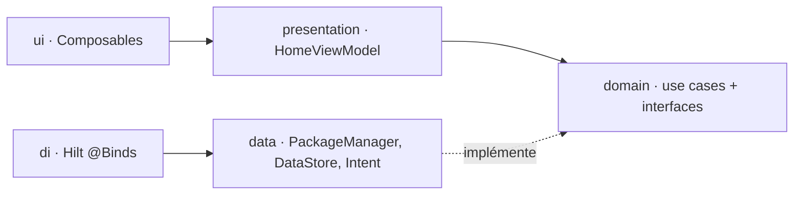

# Architecture

## Stack

- Kotlin natif et Jetpack Compose (Material 3), Android uniquement : les API `HOME` et `PackageManager` rendaient un framework cross-platform inutile (voir `docs/adr/0001`).
- Hilt pour la DI, via KSP.
- Coroutines et `Flow` de bout en bout, des repositories jusqu'au `StateFlow` de l'UI.

## How it fits together

## Key decisions

- Un seul module Gradle `:app`, découpé en couches par package. Le découpage suit les futures frontières de modules (`docs/adr/0002`).
- Les dépendances vont dans un seul sens, `presentation → domain ← data` : `presentation` n'importe jamais `data`.
- `domain` n'a aucune dépendance Android (ni `Context` ni `PackageManager`), pour rester testable en JVM pur.
- Une seule exception, assumée : `AppIconProvider` retourne un `ImageBitmap` Compose.
- Les ADR dans `docs/adr/` portent le pourquoi de chaque choix. Une nouvelle décision structurante y ajoute un ADR numéroté.

## Gotchas

- `IntentAppLauncher` démarre l'activité depuis l'application context, donc `FLAG_ACTIVITY_NEW_TASK` est obligatoire.
- `HomeScreen` neutralise le bouton back : un launcher ne se ferme jamais, sauf pour fermer le picker.
