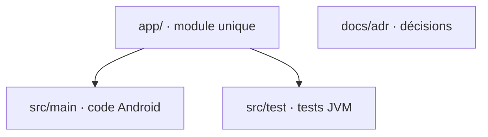

# Codebase Map

## Areas

- `app/src/main/java/com/benjaminmichel/launcher/` : un package par couche (`domain`, `data`, `di`, `presentation`, `ui`), voir `architecture.md`.
- `app/src/test/` : tests unitaires JVM et fakes des repositories.
- `docs/adr/` : Architecture Decision Records numérotés.
- `gradle/libs.versions.toml` : le catalogue de versions, seule source des dépendances.

## Entry points

- `MainActivity` : l'activité déclarée `HOME` dans `AndroidManifest.xml`, qui monte `HomeScreen`.
- `LauncherApplication` : le point d'entrée Hilt (`@HiltAndroidApp`).
