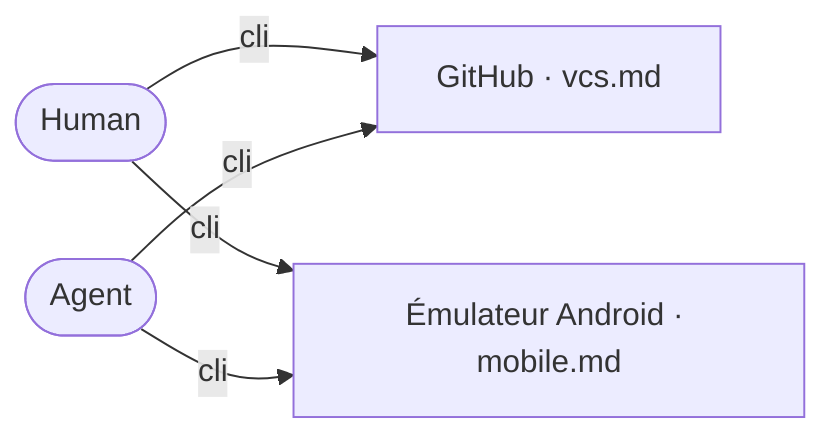

# Ecosystem

```mermaid
flowchart LR
  Human([Human])
  Agent([Agent])
  GitHub["GitHub · vcs.md"]
  Emulator["Émulateur Android · mobile.md"]

  Human -- cli --> GitHub
  Agent -- cli --> GitHub
  Human -- cli --> Emulator
  Agent -- cli --> Emulator
```
