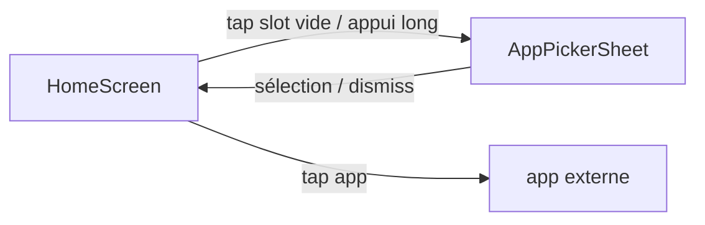

# Mobile

## Platform

- Android natif, Kotlin et Jetpack Compose, `minSdk 26`, en portrait uniquement.

## Navigation

## Native access

- `PackageManager.queryIntentActivities` liste les apps lançables. L'API `ResolveInfoFlags` est utilisée à partir de l'API 33.
- L'activité est déclarée `HOME` + `DEFAULT` en `singleTask` pour pouvoir servir d'écran d'accueil.
- Le thème utilise `windowShowWallpaper` et une `Surface` transparente : le fond d'écran système reste visible.

## UI conventions

- Tout texte posé directement sur le fond d'écran fusionne `WallpaperTextStyle` (blanc + ombre). Le style ne s'applique pas dans les surfaces opaques comme le picker.

## State and storage

- Un `HomeUiState` unique est exposé en `StateFlow` par `HomeViewModel`, qui combine apps, favoris, requête et slot ciblé.
- Les favoris sont stockés dans DataStore Preferences, une clé fixe par slot (`favorite_slot_0` à `favorite_slot_4`). Voir `docs/adr/0004`.

## Build and release

- Il n'y a pas encore de publication ni de signature release.
- En dev : `./gradlew installDebug`. Ensuite, `adb shell cmd package set-home-activity com.benjaminmichel.launcher/.MainActivity` évite le dialogue de choix du launcher à chaque installation.
- Émulateur local : AVD `Pixel_3a_API_34_extension_level_7_arm64-v8a`.
